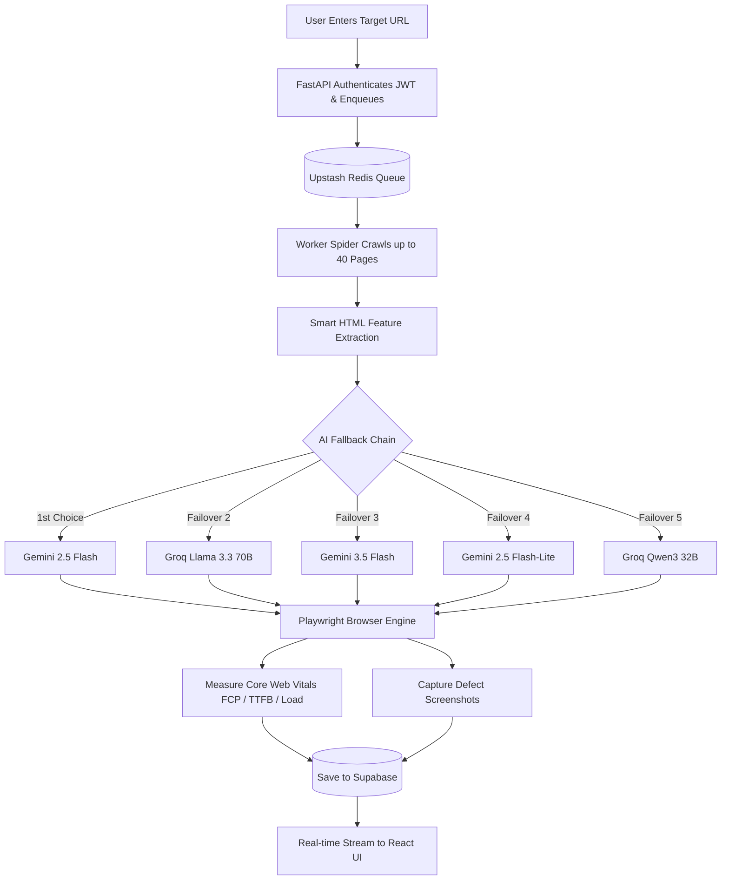

<div align="center">

# 🛡️ AuditAI — Enterprise AI Web Auditor
### Autonomous Multi-Model Web Intelligence & Forensic Audit Platform

[](https://nextjs.org/)
[](https://fastapi.tiangolo.com/)
[](https://ai.google.dev/)
[](https://supabase.com/)
[](https://upstash.com/)
[](https://playwright.dev/)

---

**AuditAI** is a distributed, full-stack SaaS platform that autonomously crawls, benchmarks, and audits any website using a resilient multi-model AI chain. It identifies defects across **Accessibility (WCAG)**, **Hydration**, **SEO**, **Code Quality**, and **Performance** — with forensic defect screenshots, real Core Web Vitals telemetry, and framework-aware remediation code.

</div>

---

## 🚀 Key Features

| Feature | Description |
|---|---|
| 🤖 **Resilient Multi-Model AI Chain** | Zero-downtime 5-tier fallback engine: `gemini-2.5-flash` ➔ `llama-3.3-70b` (Groq) ➔ `gemini-3.5-flash` ➔ `gemini-2.5-flash-lite` ➔ `qwen3-32b` (Groq) with exponential backoff. |
| ⚡ **Real Core Web Vitals Telemetry** | In-browser W3C Performance Timing extraction measuring **Full Load Time**, **First Contentful Paint (FCP)**, **Time to First Byte (TTFB)**, **DOM Content Loaded**, and **Payload Transfer Weight** with dynamic speed ratings (Fast / Average / Slow). |
| 📸 **Issue-Specific Forensic Visuals** | Headless Playwright engine navigates directly to defect URLs, captures dedicated screenshots of discovered issues, and uploads them to Supabase Storage. |
| 🕷️ **Async Deep Crawler** | Concurrent Python spider using `asyncio` + `httpx` crawling up to 40 pages with SSRF network protection against internal IP ranges. |
| 🧠 **Surgical Metadata Extraction** | Extracts document lang, canonical URLs, meta tags, heading hierarchies, images, and interactive elements without token waste. |
| 📜 **Audit Portfolio & Scan History** | Persistent scan history dashboard sorted newest-first with metrics overview (Total Audits, Average Score, Monitored Domains) and one-click historical report reloading. |
| 📄 **One-Click PDF Export** | Clean print-optimized layout allowing instant PDF export of executive summaries, diagnostics, and vulnerability matrices. |
| 🔧 **Framework-Aware Remediation** | Automatically detects site stack (React, Next.js, Vue, WordPress/PHP, plain HTML) and outputs drop-in code fixes with context anchors (`// ... existing code ...`). |
| ⚖️ **Calibrated Scoring Rubric** | Fair enterprise scoring model: deductions applied once per distinct defect pattern (-10 High, -4 Medium, -1 Low) with a calibrated 20-point minimum floor. |

---

## 🏗️ System Architecture

```
┌──────────────────┐       ┌──────────────────────┐       ┌─────────────────────┐
│  Next.js 15 UI   │──────▶│   FastAPI Gateway    │──────▶│    Upstash Redis    │
│  (React 19 / TS) │◀──────│ (JWT Auth + Rate Lim)│       │     Task Queue      │
└──────────────────┘       └──────────────────────┘       └──────────┬──────────┘
         ▲                                                           │
         │                                                           ▼
┌────────┴─────────┐       ┌──────────────────────┐       ┌─────────────────────┐
│  Supabase Vault  │◀──────│    Python Worker     │◀─────▶│  Multi-Model AI     │
│ (Postgres + Blob)│       │  Async Spider + W3C  │       │ Gemini 2.5/3.5 Flash│
└──────────────────┘       │ Playwright Engine    │       │ Groq Llama 3.3 70B  │
                           └──────────────────────┘       └─────────────────────┘
```

---

## 🛠️ Tech Stack

### Frontend
- **Framework:** Next.js 15 (App Router) + React 19 + TypeScript
- **Styling:** Tailwind CSS with dark glassmorphism aesthetic
- **Icons:** Lucide React
- **Auth:** Supabase Auth (Server-side ECC P-256 JWT validation)
- **Export:** Browser-native Print & PDF rendering

### Backend API
- **Framework:** FastAPI (Python 3.10+)
- **Security:** SlowAPI rate-limiting (5 requests/minute/IP) + SSRF IP filtering
- **Auth Client:** Supabase Python SDK

### Distributed Worker & Engine
- **Spider:** `asyncio` + `httpx` + `BeautifulSoup4`
- **Headless Browser:** Playwright Chromium (Forensic Screenshots + W3C Navigation Timing)
- **Primary AI:** Google Gemini SDK (`google-genai`)
- **Emergency AI:** Groq SDK (`groq` LPU-accelerated Llama-3.3-70B & Qwen3-32B)

### Infrastructure
- **Database & Storage:** Supabase PostgreSQL + Supabase Storage Bucket (`screenshots`)
- **Task Queue:** Upstash Redis (Serverless REST)

---

## ⚡ Quick Start

### Prerequisites
- Python 3.10+
- Node.js 18+
- [Supabase](https://supabase.com) account & project
- [Upstash Redis](https://upstash.com) database
- [Google AI Studio](https://aistudio.google.com) API Key
- *(Optional)* [Groq Console](https://console.groq.com) API Key for secondary backup AI

---

### 1. Clone the Repository

```bash
git clone https://github.com/hitesh-45s/ai-auditor-saas.git
cd ai-auditor-saas
```

---

### 2. Configure Environment Variables

Create `.env` in the root project directory:

```env
# Supabase
SUPABASE_URL="https://your-project.supabase.co"
SUPABASE_SERVICE_KEY="your-supabase-service-role-key"

# Upstash Redis
UPSTASH_REDIS_REST_URL="https://your-instance.upstash.io"
UPSTASH_REDIS_REST_TOKEN="your-upstash-token"

# Primary AI - Google Gemini
GEMINI_API_KEY="your-gemini-api-key"

# Backup AI - Groq (Optional but recommended)
GROQ_API_KEY="your-groq-api-key"

# API URL
NEXT_PUBLIC_API_URL="http://localhost:8000"
```

Create `frontend/.env.local`:

```env
NEXT_PUBLIC_SUPABASE_URL="https://your-project.supabase.co"
NEXT_PUBLIC_SUPABASE_ANON_KEY="your-supabase-anon-key"
NEXT_PUBLIC_API_URL="http://localhost:8000"
```

---

### 3. Initialize Database Schema

Run the SQL migration script located at [`backend/schema.sql`](backend/schema.sql) in your **Supabase SQL Editor**.

Next, create a public storage bucket for screenshots:
1. Go to **Supabase Dashboard** ➔ **Storage**
2. Click **New Bucket** ➔ Name it `screenshots`
3. Enable **Public Bucket**

---

### 4. Setup Backend & Worker

```bash
cd backend
python -m venv venv
venv\Scripts\activate      # Windows (or: source venv/bin/activate on Linux/Mac)
pip install -r requirements.txt
playwright install chromium
```

**Terminal 1 — Start the API Gateway:**
```bash
uvicorn main:app --reload --port 8000
```

**Terminal 2 — Start the Background Audit Worker:**
```bash
python worker.py
```

---

### 5. Setup Frontend

**Terminal 3 — Start Next.js:**
```bash
cd frontend
npm install
npm run dev
```

Open [http://localhost:3000](http://localhost:3000) in your browser!

---

## 🔍 How an Audit Works



---

## 📊 Calibrated Scoring Rubric

To prevent false deductions on enterprise sites (such as Stripe or Vercel), defects are penalized **once per structural pattern** rather than multiplied across every crawled page:

| Severity | Deduction | Qualification |
|---|---|---|
| 🔴 **High** | **-7 pts** | Critical functional blockers (broken auth/forms, major missing keyboard navigation, severe WCAG Level A/AA failures) |
| 🟡 **Medium** | **-3 pts** | Minor accessibility flaws, hydration warnings, missing descriptive image attributes, suboptimal layout shifts |
| 🔵 **Low** | **-1 pt** | Minor code hygiene, missing non-critical meta tags, heading order preference |

*Starting Score: **100** · Floor Minimum: **20***

---

## 🔒 Security Architecture

- **Server-Side Token Verification:** All API calls authenticate via Supabase Auth ECC P-256 tokens directly at the gateway.
- **SSRF Defense:** The spider performs DNS resolution before connection and immediately drops private/internal IP blocks (`127.0.0.0/8`, `10.0.0.0/8`, `169.254.0.0/16`, `192.168.0.0/16`).
- **Distributed Rate Limiting:** Enforced via `slowapi` to protect against denial of service and API credit drain.
- **Zero Secrets on Client:** Database credentials, Redis tokens, and AI keys are strictly kept server-side in the backend environment.

---

## 🤝 Contributing

Pull requests are welcome! If you encounter issues or have ideas for additional diagnostic checks, please open an issue on GitHub.

Built with 🧠 **AI** + ☕ **Coffee**
